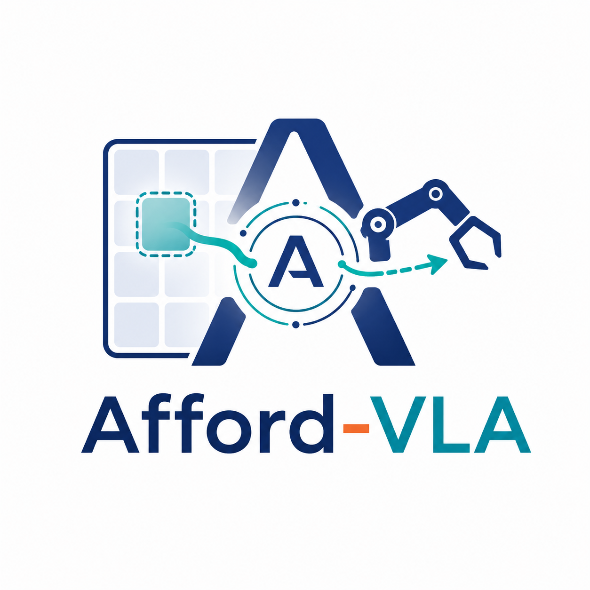
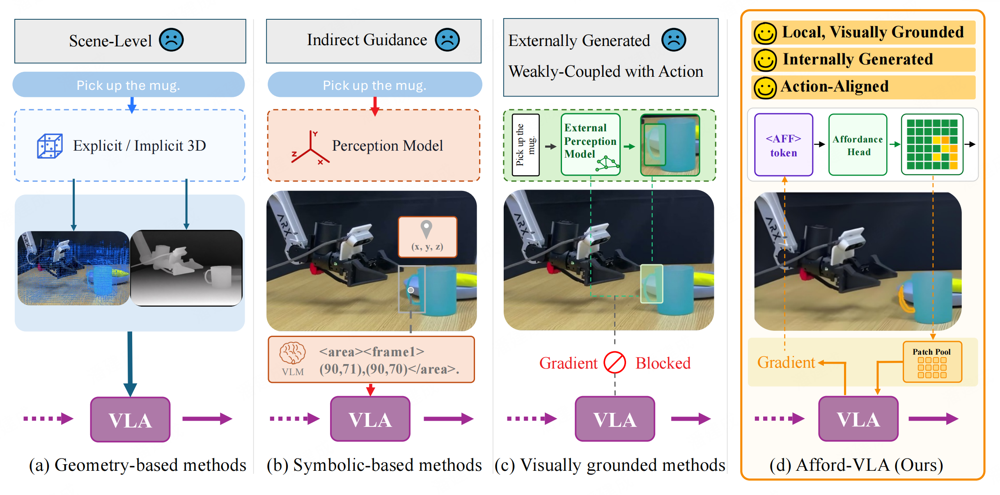
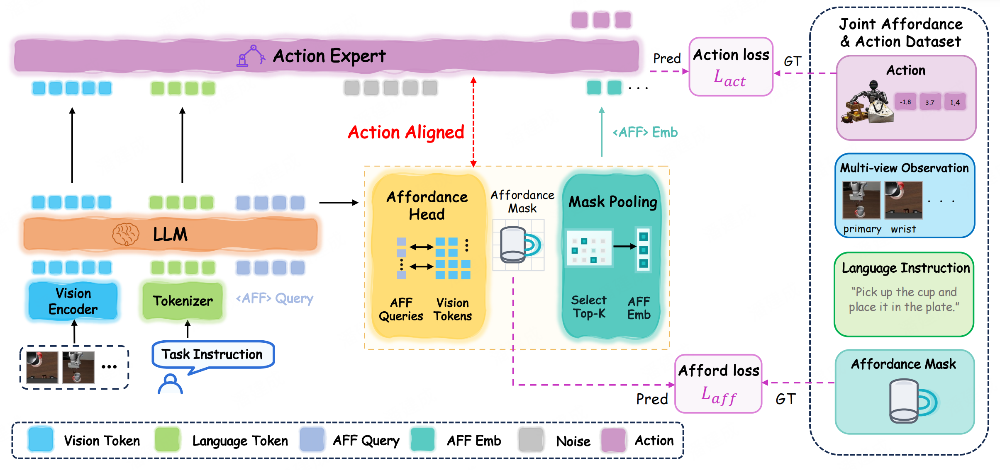

<div align="center">



<h1>Afford-VLA: Action-Aligned Visual Planning via Internalized Affordance</h1>

<h4>
  <em>Runze Wang<sup>*</sup>, &nbsp;&nbsp; Yuqian Fu<sup>*</sup>, &nbsp;&nbsp; Yu Li, &nbsp;&nbsp; Tao Lin, &nbsp;&nbsp; Tianwen Qian</em>
</h4>
<h4>
  <em>Mohamed Elhoseiny, &nbsp;&nbsp; Bo Zhao, &nbsp;&nbsp; Yanwei Fu, &nbsp;&nbsp; Yu-Gang Jiang, &nbsp;&nbsp; Xiangyang Xue</em>
</h4>

<p>
  <a href="https://arxiv.org/abs/2605.24203">
    
  </a>
</p>

</div>


## News

- [2024.0705] Our code is released!
- [2026.0522] Our paper is up on [arXiv](https://arxiv.org/abs/2605.24203).

## Features

### ✨ Effective Visual Planning Paradigm for VLA Systems

We revisit visual planning in VLA systems and argue that effective planning should be local, visually grounded, internally generated, and directly aligned with action.

<p align="center">
  
</p>

### ✨ Afford-VLA Framework

We propose Afford-VLA, a unified framework that internalizes task-conditioned affordance as an explicit visual planning interface, enabling interaction regions to be directly learned and leveraged for action generation.

<p align="center">
  
</p>


## Installation

See [Installation instructions.](docs/INSTALL.md)

## Data

See [Prepare Training Data.](docs/DATASET.md)

## Train

See [Train Afford-VLA.](docs/TRAIN.md)

## Evaluation

See [Evaluate Afford-VLA.](docs/EVALUATE.md)

## Citation

If you think this work is useful for your research, please use the following BibTeX entry.

```
@article{wang2026afford,
  title={Afford-VLA: Action-Aligned Visual Planning via Internalized Affordance},
  author={Wang, Runze and Fu, Yuqian and Li, Yu and Lin, Tao and Qian, Tianwen and Elhoseiny, Mohamed and Zhao, Bo and Fu, Yanwei and Jiang, Yu-Gang and Xue, Xiangyang},
  journal={arXiv preprint arXiv:2605.24203},
  year={2026}
}
```

## Acknowledgement

Thanks for awesome works: [PSALM](https://github.com/zamling/PSALM/blob/main/) , [LLaVA](https://github.com/haotian-liu/LLaVA) and [Ego-Exo4D](https://ego-exo4d-data.org). Code is based on these works.